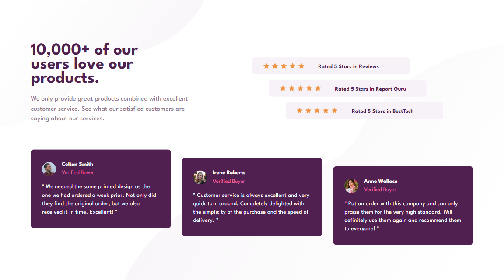

# Frontend Mentor - Social proof section solution

This is a solution to the [Social proof section challenge on Frontend Mentor](https://www.frontendmentor.io/challenges/social-proof-section-6e0qTv_bA). Frontend Mentor challenges help you improve your coding skills by building realistic projects. 

## Table of contents

- [Overview](#overview)
  - [The challenge](#the-challenge)
  - [Screenshot](#screenshot)
  - [Links](#links)
- [My process](#my-process)
  - [Built with](#built-with)
  - [What I learned](#what-i-learned)
  - [Continued development](#continued-development)
  - [Useful resources](#useful-resources)
- [Author](#author)
- [Acknowledgments](#acknowledgments)

## Overview

### The challenge

Users should be able to:

- View the optimal layout for the section depending on their device's screen size

### Screenshot



### Links

- Solution URL: [Solution](https://github.com/JustANipple/social-proof-section/blob/main/style.css)
- Live Site URL: [Live site](https://justanipple.github.io/social-proof-section/)

## My process

### Built with

- Semantic HTML5 markup
- CSS custom properties
- Flexbox
- Josh's Custom CSS Reset
- Custom properties
- Media queries

### What I learned

I was finding hard to organize spacing between blocks and i found on Youtube a custom CSS reset template from joshcumeau that does some helpful stuff, like removing margins or making images more responsive

Next i had to find a way to organize all the styling into one block, to make it easier to read and modify. This is when i discovered custom properties, and made it possible

```css
:root {
    --clr-primary-700: hsl(300, 43%, 22%);
    --clr-primary-400: hsl(333, 80%, 67%);
    
    --clr-neutral-400: hsl(303, 10%, 53%);
    --clr-neutral-stars-background: hsl(300, 24%, 96%);
    --clr-neutral-review-400: hsl(0, 0%, 100%);

    --ff-base: 'League Spartan', sans-serif;

    --fw-regular: 400;
    --fw-medium: 500;
    --fw-bold: 700;
}
```

The last biggest problem was finding a way to place an SVG not as an element, but as a repeatable background image for the rating stars. I don't know if i achieved the best way to do it, but i found a URL-encoder site that takes the SVG and gives you the background-image url to use it in the CSS styling page

### Continued development

I'm still getting confused the first time a look at a project. Should i make the mobile version first? should i do the desktop one?
I'll focus more on giving spacing units in REMs and not in pixels, so i can just change one sizing to adjust the entire site

### Useful resources

- [URL-encoder for SVG](https://yoksel.github.io/url-encoder/) - I used it to convert SVG to URL for stars in the rating part
- [Josh's Custom CSS Reset](https://www.joshwcomeau.com/css/custom-css-reset/) - This made spacing and positioning more intuitive

## Author

- Frontend Mentor - [@JustANipple](https://www.frontendmentor.io/profile/JustANipple)

## Acknowledgments

I liked a lot a video that was taking one of the earlier projects from frontendmentor.io (https://www.youtube.com/watch?v=B2WL6KkqhLQ&t=3273s).
With this, i learned a lot about organizing and spacing
